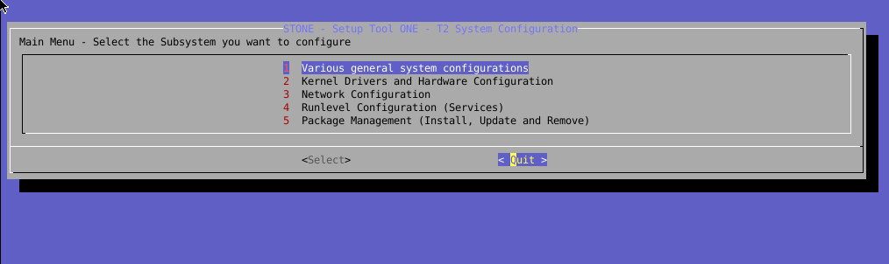

# gentoo-stone
stone: Setup Tool ONE1 + for gentoo

## Dialog
gentoo-stone $ ./stone.sh -dialog


## Text
|  Main Menu - Select the Subsystem you want to configure
+---
```
    1. Various general system configurations
    2. Kernel Drivers and Hardware Configuration
    3. Network Configuration
    4. Runlevel Configuration (Services)
    5. Package Management (Install, Update and Remove)
```

## Usage
gentoo-stone $ ./stone.sh --help

STONE - Setup Tool ONE - System Configuration
```
Usage: ./stone.sh [ -text | -dialog | -x11 ] [ module [ command ] ]
```
